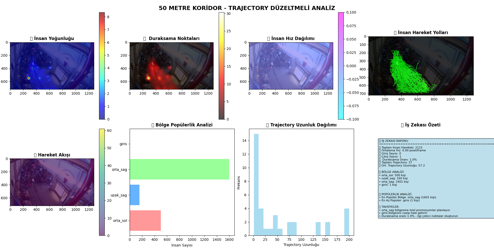

# 🌀 FlowTrackAI

### Lightweight AI for Retail Behavior & Spatial Flow Analysis

---

FlowTrackAI is a **research-stage**, **privacy-first** computer vision toolkit that converts **security camera feeds into actionable retail intelligence** — providing **footfall metrics**, **attention & dwell heatmaps**, **movement flow**, and **trajectory analysis** for aisles, corridors, markets, and shopping malls.

This repository is a **prototype / testbed**: it uses a **basic YOLOv8 model** as a starting point and is intended for **experimental development, dataset generation, and research** — not a production-grade out-of-the-box solution.

---

## 📁 Repository Layout

```
Files
├── Figure1.png
├── README.md
├── main.py
├── trained_model_best.zip
└── yolov8s.pt
```
---

## 🎯 Project Purpose & Scope

FlowTrackAI helps **retailers, researchers, and analysts** understand **human movement and behavior** in physical retail spaces by enabling:

* 👣 **Visitor counting & trajectory mapping**
* 🔥 **Density / attention heatmaps**
* 🕒 **Stationary & dwell-point visualization**
* 🗺️ **Zone popularity and flow metrics**
* 💡 **Business intelligence summaries** for layout optimization

> **Status:**
> Prototype / Proof-of-concept using a baseline YOLOv8 model.
> Real deployments will require **custom dataset training**, **camera calibration**, and **privacy safeguards**.

---

## ⚙️ How It Works — Technical Overview

### 1. Frame Capture

Frames are extracted from local video files or **M3U8 live streams** (via OpenCV).
They are saved in `dataset_frames/` for offline analysis.

### 2. Person Detection

YOLOv8 detects “person” bounding boxes in each frame with configurable confidence thresholds.

### 3. Trajectory Tracking

A **distance-based tracker** associates detections frame-to-frame using a `tracking_threshold`.
Trajectory smoothing and foot-point estimation improve spatial precision.

### 4. Heatmap Generation

Multiple heatmaps are built per frame and aggregated over time:

* **Density Heatmap** – visit frequency
* **Stationary Heatmap** – dwell & pause points
* **Velocity Heatmap** – movement speed
* **Flow Heatmap** – overall flow direction & magnitude
* **Zone Heatmap** – region-based aggregation

Gaussian filtering produces smoother, more interpretable visuals.

### 5. Zone Definition & Analytics

The frame is divided into predefined zones (`entry`, `mid-left`, `mid-right`, `far-left`, `far-right`, `exit`).
The system tracks per-zone visits, dwell time, and entry/exit flow to generate BI summaries.

### 6. Visualization & Output

FlowTrackAI outputs:

* 🖼️ Matplotlib-based **multi-plot analysis figures**
* 📈 **Statistical summaries**
* 💬 **Business Intelligence reports** (`.txt`, `.json`)
* Results saved under `analysis_results/` and `business_reports/`

---

## 🖼️ Example Output — *Figure 1*



**Figure 1** demonstrates a **trajectory-corrected corridor analysis** and includes:

| Plot                  | Description                                |
| --------------------- | ------------------------------------------ |
| Density Heatmap       | Frequency of movement; red = high activity |
| Stationary Map        | Where people stop or dwell                 |
| Velocity Map          | Speed variation across space               |
| Trajectory Overlay    | Path of individuals (green lines)          |
| Flow Heatmap          | Movement direction & density               |
| Zone Popularity       | Per-zone visit counts                      |
| Path Length Histogram | Distribution of trajectory lengths         |
| BI Summary            | Text insights & recommendations            |

> 🧩 *Interpretation:*
> This visualization shows how FlowTrackAI transforms raw camera footage into interpretable metrics for **store layout optimization, congestion analysis**, and **behavioral research**.

---

## 🔧 Installation

```bash
# 1. Create a virtual environment
python -m venv .venv
source .venv/bin/activate         # Linux / macOS
# .venv\Scripts\activate          # Windows PowerShell

# 2. Install dependencies
pip install --upgrade pip
pip install ultralytics opencv-python numpy matplotlib pandas scikit-learn seaborn scipy pillow
```

> For GPU acceleration, install **PyTorch** following the official instructions:
> 🔗 [https://pytorch.org/get-started/locally/](https://pytorch.org/get-started/locally/)

**Note on `yolov8s.pt`:**
Use **Git LFS** or a download link to avoid large binary issues.
Ultralytics will automatically fetch pretrained weights if unavailable.

---

## ▶️ Quick Start

```bash
# Ensure frame data exists in dataset_frames/
python main.py
```

* 🎬 Capture frames or connect an M3U8 stream
* 🤖 Train (light test dataset)
* 📊 Run “Advanced Analysis” for heatmaps and reports

Results are saved under:

```
analysis_results/
business_reports/
```

---

## ⚠️ Limitations

* **Basic tracking:** Distance-based; may lose identity after occlusion
* **No camera calibration:** Units are in pixels, not real-world metrics
* **Privacy compliance required:** Do not store identifiable data without consent
* **Large models:** `yolov8s.pt` may exceed Git’s default limit; use Git LFS
* **Performance:** CPU-only operation is slow; GPU acceleration recommended

---

## 🔐 Privacy & Ethics

FlowTrackAI prioritizes **on-premise analytics** to reduce privacy risks.

### Recommended Safeguards:

* Blur or anonymize faces before storage
* Limit raw footage retention
* Control data access and maintain audit logs
* Comply with GDPR or local privacy regulations

---

## 🚀 Roadmap & Future Development

| Phase          | Goals                                                                   |
| -------------- | ----------------------------------------------------------------------- |
| **Short-term** | Add camera calibration (pixel → meter), DeepSORT tracker, BI CSV export |
| **Mid-term**   | Multi-camera stitching, YOLO fine-tuning on in-store datasets           |
| **Long-term**  | Edge AI dashboard, ONNX/TensorRT deployment, POS data integration       |

---

## 🤝 Contributing

Contributions are welcome!
Open issues or submit PRs for improvements in:

* ReID-based tracking
* Calibration tools
* Privacy modules (face blurring)
* Dashboard or BI integration

---

## ⚖️ License

This repository is shared **for research and prototyping**.
If you plan to reuse or extend it, include a suitable license (e.g., MIT).
For commercial applications, ensure compliance with YOLO model and privacy terms.

---

## 📬 Contact

**📧 Email:** [omerc3v@gmail.com](mailto:omerc3v@gmail.com)
**🔗 LinkedIn:** [linkedin.com/in/cevheromer](https://www.linkedin.com/in/cevheromer)

For collaboration, research discussions, or demonstrations, please get in touch.

---


### 👤 Author

Omer Cevher – [GitHub Profile](https://github.com/CevherOmer)

---
© 2025 Omer Cevher — FlowTrackAI Research Prototype

